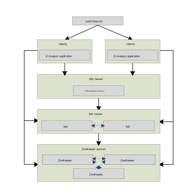

# Understanding the Analyze-Containers repository

The Analyze-Containers repository provides Dockerfiles and example scripts that provide a reference architecture for creating a containerised deployment of i2 Analyze. The scripts demonstrate how to build Docker images and enable you to deploy, configure, and run i2 Analyze on Docker containers.

## How to use the Analyze-Containers repository?

The repository is designed to be used with the i2 Analyze minimal toolkit. The minimal toolkit is similar to the standard i2 Analyze deployment toolkit, except that it only includes the minimum amount of application and configuration files. The i2 Analyze minimal toolkit is used to provide the artefacts that are required to build the images and provide the configuration for the deployment. Bash scripts are then used to build the images and run the containers.

To demonstrate creating an example containerized deployment, complete the actions described in [Getting started](./getting_started.md).

The minimal toolkit also contains the tools that are used by the bash scripts to deploy, configure, and administer your deployment of i2 Analyze. The tools are in the form of JAR files that are called from shell scripts. For more information about the tools that are available and their usage, see [i2 Analyze tools](../tools%20and%20functions/i2analyze_tools.md).

### Dockerfiles and images

A deployment of i2 Analyze consists of the following components:
- Liberty
- Solr
- ZooKeeper
- Optionally a database management system

The Analyze-Containers repository contains the Dockerfiles that are used to build the images for each component. For Liberty and SQL Server, the image provided by Liberty and SQL Server is used.

For Solr and ZooKeeper, the repository contains custom Dockerfiles that were created from the ones provided by Solr and ZooKeeper.

For more information about the images and containers, see [images and containers](../images%20and%20containers/).

### Scripts

The Analyze-Containers repository provides example scripts that you can use and leverage for your own deployment use cases. The Analyze-Containers repository contains a number of scripts that are designed to be used at various stages when working towards creating a production system. 

The repository also includes example artifacts that are used with the scripts. These artifacts include an example certificate authority and certificates, secrets and keys to be used with i2 Analyze, and utilities that are used by the example scripts.

### Walkthroughs

A number of walkthroughs are provided that demonstrate how to complete configuration and administration tasks in a containerized deployment. The walkthroughs consist of a reference script that demonstrates how to complete the action, and a document that explain the process in more detail.

## What is deployed?

When you run the provided scripts, i2 Analyze is deployed in the following topology: 

The deployment includes:
- A load balancer container, using HAProxy
- Two Liberty containers configured for high availability
- A Solr cluster with two Solr containers
- A ZooKeeper ensemble with three ZooKeeper containers
- A SQL Server container

A number of "client" ephemeral containers are used to complete a single actions.

The following client containers are used:
- SQL Server client
- Solr client

For more information about the images and containers, see [images and containers](../images%20and%20containers/).